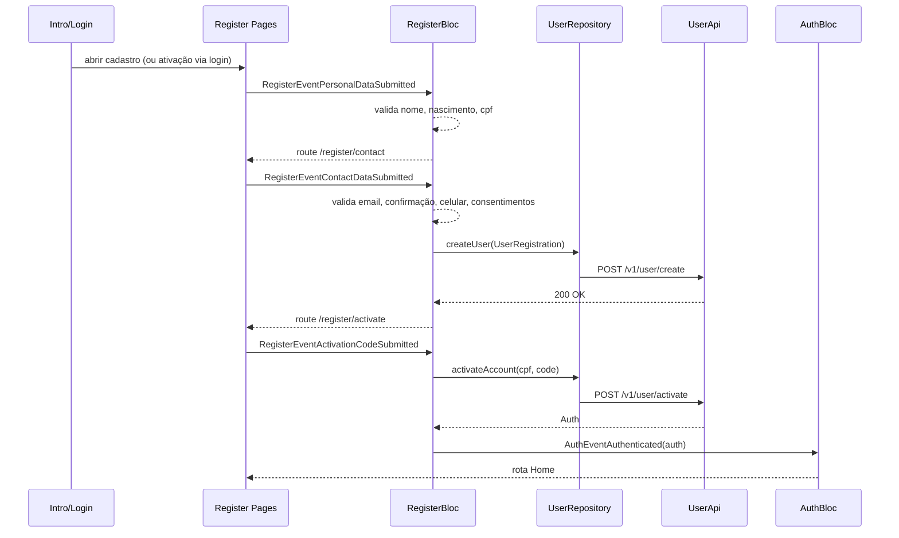

## Visão geral

O cadastro no `geru-app` é um fluxo em 3 etapas orientado por `RegisterBloc`:

1. coleta de dados pessoais
2. coleta de contato e consentimentos
3. ativação por código

Após ativação válida, o app autentica o usuário localmente via `AuthBloc` e navega para a jornada principal.

## Pontos de entrada

- **Intro (`/intro`)**: botão **Criar conta** navega para `RegisterRoute.personalData`.
- **Login (`/login`)**: quando `sendValidationCode` retorna `page == activation`, o app direciona para `RegisterRoute.activate` com CPF já preenchido.

Referências:

- `lib/modules/intro/pages/intro_page.dart`
- `lib/modules/login/bloc/login_bloc.dart`

## Componentes e responsabilidades

- `RegisterModule` (`lib/modules/register/register_module.dart`): declara rotas e analytics de entrada.
- `RegisterBloc` (`lib/modules/register/bloc/register_bloc.dart`): orquestra validação, chamadas de API, timers e navegação.
- `UserRepository` / `UserApiImpl` (`lib/libs/user/**`): integração com backend de criação/ativação.
- `AuthBloc` (`lib/libs/auth/blocs/auth_bloc.dart`): persiste sessão após ativação.

## Fluxo principal (novo usuário)

### 1) Dados pessoais (`/register/`)

Campos:

- nome completo
- data de nascimento
- CPF

No submit (`RegisterEventPersonalDataSubmitted`), o `RegisterBloc` valida os campos com `Formz`. Se válido, segue para `RegisterRoute.contactData`.

### 2) Contato e consentimento (`/register/contact`)

Campos e regras:

- e-mail
- confirmação de e-mail
- celular
- aceite de termos
- aceite de política de privacidade

No submit (`RegisterEventContactDataSubmitted`):

1. valida o formulário;
2. monta `UserRegistration`;
3. chama `POST /v1/user/create`;
4. inicia timer de reenvio (`secondsToResendCode = 30`);
5. navega para `RegisterRoute.activate`.

Payload enviado em `createUser`:

```json
{
  "name": "string",
  "email": "string",
  "cpf": 12345678901,
  "mobile": 11999999999,
  "dateOfBirth": "2026-03-24T00:00:00.000Z"
}
```

### 3) Ativação (`/register/activate`)

Comportamento da tela:

- usuário informa código recebido por e-mail;
- submit dispara `POST /v1/user/activate` com `cpf + code`;
- sucesso retorna `Auth`, dispara `AuthEventAuthenticated` e conclui sessão;
- falha por código inválido vira `InvalidCodeException` (mensagem para o usuário).

Reenvio de código:

- botão habilita ao fim do timer (`30s`);
- ação chama `POST /v1/user/activate/send`.

Ajuda contextual:

- após `45s` sem sucesso, o app abre `RegisterRoute.help` (bottom sheet “Não recebeu o código?”).

## Fluxo alternativo (usuário existente pendente de ativação)

No login, após CPF (`LoginEventEmailSubmitted`), o backend pode retornar `page = activation` em `POST /v1/user/send/validation-code`.

Nesse caso:

1. app navega para `RegisterRoute.activate` com CPF via argumento;
2. `RegisterActivationPage` dispara `RegisterEventActivateExistingUser(document)`;
3. `RegisterBloc` preenche CPF no estado e solicita envio de código (`sendActivationCode`);
4. usuário conclui ativação e segue autenticação normal.

Isso evita duplicação de conta e reaproveita a mesma etapa de ativação do fluxo de cadastro.

## Navegação e tratamento de erros

- Navegação de sucesso no cadastro: `personalData -> contactData -> activate -> home`.
- Falhas de infraestrutura/API em criação tendem a redirecionar para `ErrorRoute.fromException(e)`.
- Falha de código de ativação mantém usuário na tela de OTP com mensagem de erro.

## Observabilidade (Analytics)

Eventos relevantes enviados por `Analytics`:

- `register_personal_data_enter`
- `register_personal_data_completed`
- `register_contact_data_completed`
- `register_activate_account_enter`
- `register_activate_account_completed`
- `register_activation_code_resent`
- `register_help_enter`

Referência: `lib/libs/common/utils/analytics.dart`.

## Diagrama de sequência



## Endpoints envolvidos

- `POST /v1/user/create`
- `POST /v1/user/activate`
- `POST /v1/user/activate/send`
- `POST /v1/user/send/validation-code` (branch de ativação vindo do login)
