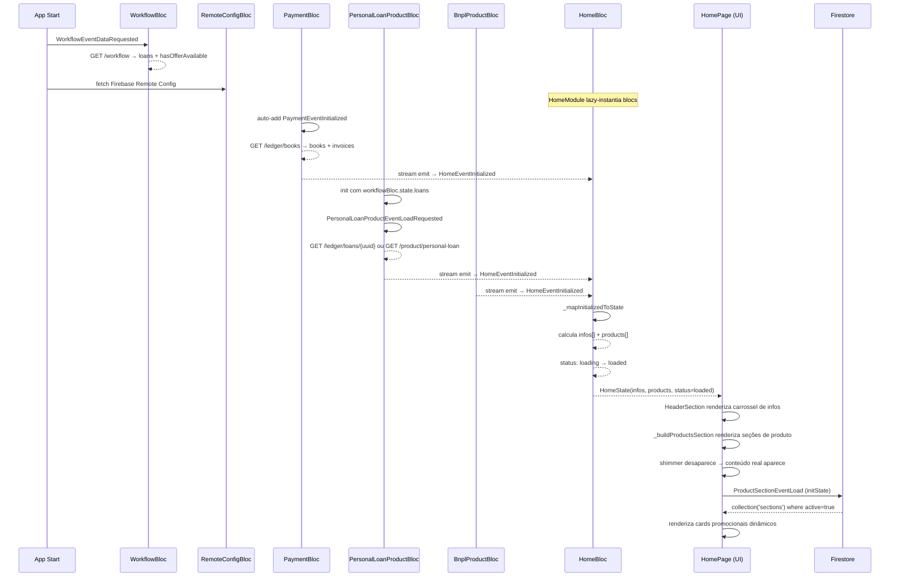

## Visão geral

A `HomePage` **não busca dados diretamente**. Ela observa o estado de BLoCs que já foram inicializados antes da navegação. O `HomeBloc` agrega e combina esses estados para decidir o que exibir em cada seção.

## Cadeia de dependências

```text
WorkflowBloc (carregado no login)
    └── PersonalLoanProductBloc  ──┐
                                   │
PaymentBloc (auto-init)  ──────────┤──▶  HomeBloc  ──▶  HomePage (UI)
    └── InvoicesBloc               │
                                   │
BnplProductBloc  ──────────────────┘

GeruPayProductBloc   (consultado via state)
GeruShopProductBloc  (consultado via state)
FgtsProductBloc      (consultado via state)
OverflowBloc         (consultado via state)
RemoteConfigBloc     (Firebase Remote Config)
```

## Fase 1 — Inicialização dos BLoCs upstream

| BLoC | Trigger de init | O que busca |
|---|---|---|
| `WorkflowBloc` | Login completo | `GET /workflow` → loans + hasOfferAvailable |
| `RemoteConfigBloc` | App start | Firebase Remote Config (feature flags) |
| `PaymentBloc` | Auto no construtor | `GET /ledger/books` → livros + faturas + pendências |
| `PersonalLoanProductBloc` | Dados do WorkflowBloc | `GET /ledger/loans/{uuid}` ou `GET /product/personal-loan` |
| `BnplProductBloc` | Root module | Pedidos BNPL pendentes |
| `GeruPayProductBloc` | HomeModule lazy | Limite GeruPay disponível |
| `FgtsProductBloc` | HomeModule lazy | Disponibilidade FGTS via WorkflowBloc |

## Fase 2 — HomeBloc reage via stream subscriptions

O `HomeBloc` assina **3 streams** no construtor. Qualquer emissão dispara `HomeEventInitialized`:

```dart
_paymentSubscription        = paymentBloc.listenWithLastState((_) => add(HomeEventInitialized()));
_personalLoanSubscription   = personalLoanProductBloc.listenWithLastState((_) => add(HomeEventInitialized()));
_bnplProductSubscription    = bnplProductBloc.listenWithLastState((_) => add(HomeEventInitialized()));
```

O `listenWithLastState` garante que o último estado conhecido é emitido imediatamente ao se inscrever, evitando race conditions.

## Fase 3 — Montagem do `HomeState`

A cada evento, o bloc constrói duas listas:

### `infos[]` — banners do carrossel (`HeaderSection`)

| `HomeInfo` | Condição |
|---|---|
| `payrollLoan` | `remoteConfig.showPayrollLoanInfo == true` |
| `fgtsPending` | FGTS não disponível + flag habilitada |
| `currentPersonalLoan` | Empréstimo ativo no `PersonalLoanProductBloc` |
| `offerAvailable` | Oferta disponível + flag `canOriginationPersonalLoan` |
| `overduePayment` | `paymentBloc.state.isLate` ou empréstimo em atraso |
| `pendingPayments` | Faturas pendentes dentro de 5 dias do vencimento |
| `overflowPending` | `overflowBloc.state.status == OverflowStatus.declined` |
| `overflowSuccessful` | `overflowBloc.state.status == OverflowStatus.success` |
| `pendingApplications` | `bnplProductBloc.state.applications.isNotEmpty` |

### `products[]` — seções de produto exibidas no scroll

| `HomeProduct` | Condição |
|---|---|
| `amazon` | Sempre presente |
| `payrollLoan` | Sempre presente |
| `fgts` | Sempre presente |
| `geruPay` | Limite GeruPay disponível + flag OR `hasGeruPayBook` |
| `geruShop` | `hasGeruShopBook` (sem geruPay disponível) |
| `personalLoan` | infos não vazia, ou empréstimo granted/declined/sold |
| `geruShopPromotion` | `remoteConfig.showGeruShopPromotional` |
| `geruPayPromotion` | `remoteConfig.showGeruPayPromotional` |
| `geruShopWarmUp` | Sempre adicionado ao final |

### Status de loading

```dart
status = (paymentBloc.loading || personalLoanProductBloc.loading)
    ? HomeStatus.loading   // exibe shimmer (skeleton)
    : HomeStatus.loaded    // exibe conteúdo real
```

## Fase 4 — `HomeProductSectionsWidget` (Firestore)

Este widget é **independente do `HomeBloc`**. Em `initState()` dispara:

```dart
_bloc.add(ProductSectionEventLoad());
// → ProductSectionRepository.getActiveSections()
// → Firestore: collection('sections').where('active', isEqualTo: true).get()
```

Busca seções promocionais dinâmicas do Firestore e renderiza cards com imagem de fundo e link externo.

## Diagrama de sequência



## Pontos de atenção

- **Sem estado `error` no `HomeBloc`** — falhas nos BLoCs upstream são silenciosas na home; a seção simplesmente não aparece.
- **`print()` de debug ativo** em `HomeProductSectionsWidget` (`print('HomeProductSectionsWidget - state: ...')`).
- Toda a lógica de negócio (quais seções/banners mostrar) está centralizada em `HomeBloc._mapInitializedToState`, não na UI.
- Os atalhos da home (`ShortcutButton`) consomem diretamente o estado dos BLoCs via `bloc.paymentBloc.state`, sem passar pelo `HomeBloc`.
