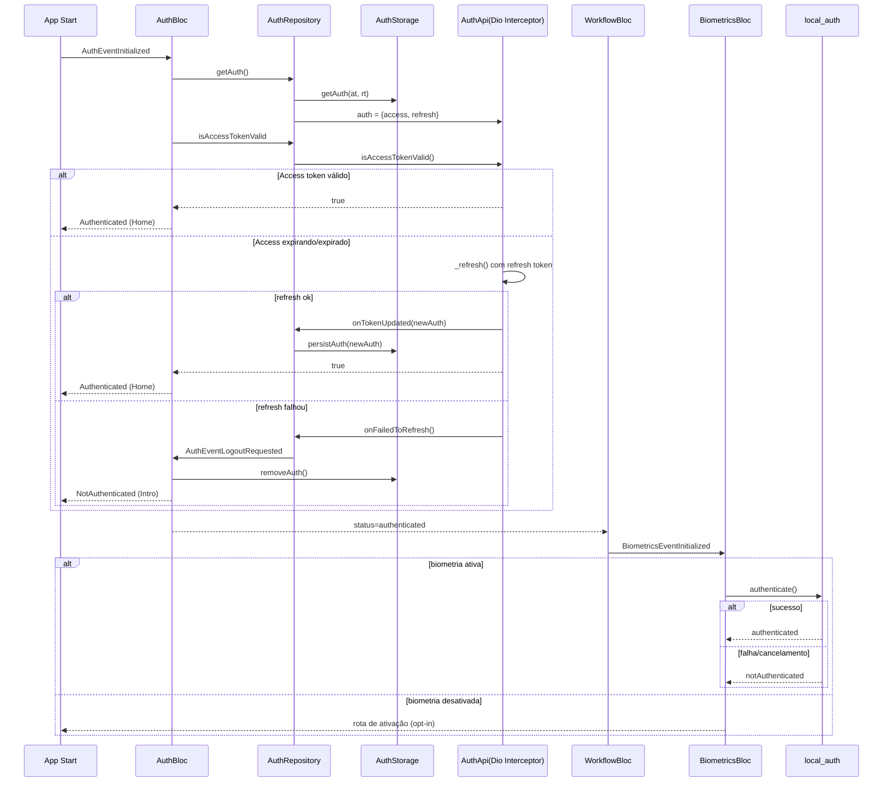

## Visão geral

No projeto atual, o login backend é feito por `CPF + código`.
A biometria funciona como **desbloqueio local da sessão** e não como autenticação primária no backend.

## Componentes envolvidos

- `AuthBloc` em `lib/libs/auth/blocs/auth_bloc.dart`
- `AuthRepository` em `lib/libs/auth/repositories/auth_repository.dart`
- `AuthApiImpl` em `lib/libs/auth/api/auth_api.dart`
- `AuthStorageImpl` em `lib/libs/auth/storage/auth_storage.dart`
- `BiometricsBloc` em `lib/modules/biometrics/blocs/biometrics_bloc.dart`
- `BiometricsStorageImpl` em `lib/modules/biometrics/storage/biometrics_storage.dart`
- `WorkflowBloc` em `lib/modules/workflow/blocs/workflow_bloc.dart`

## Sequência fim a fim

## Fluxo de login (backend)

1. `LoginBloc` envia `AuthEventAuthRequested(document, code)`.
2. `AuthBloc` chama `AuthRepository.authenticate()`.
3. `AuthApiImpl` faz `POST /v1/oauth/token-validation-code`.
4. Em sucesso, `AuthEventAuthenticated` persiste `access_token` e `refresh_token`.
5. App navega para Home e dispara carregamento de workflow.

## Fluxo de refresh token

O refresh é transparente ao usuário, via interceptor do `Dio` em `AuthApiImpl`.

- **Antes da request**: `_onRequest` verifica se a rota exige autorização.
- **Token com até 60s de validade**: tenta `_refresh()` automaticamente.
- **Se 401**: `_onError` tenta refresh e repete a request original.
- **Se refresh falhar**: dispara logout (`onFailedToRefresh` -> `AuthEventLogoutRequested`).

## Fluxo de biometria

- `BiometricsBloc` é acionado quando o usuário está autenticado.
- Estado `active` é lido de `BiometricsStorage`.
- Se ativo, o app pede autenticação local (`local_auth`).
- Se desativado, pode abrir tela de ativação.
- No `resume` do app, se ativo, a biometria é solicitada novamente.

## Observações importantes

- Biometria aqui é **gate local** de UX/segurança; não troca o token backend.
- Sessão backend continua dependente de `access_token` + `refresh_token`.
- Sem refresh válido, o fluxo cai para logout e retorno ao intro/login.
